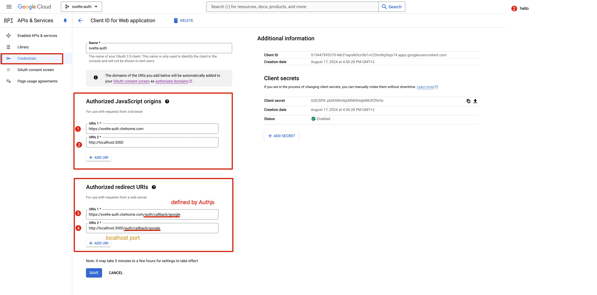

# Ctwhome top-sveltekit
Unified full-stack with SvelteKit (Svelte 5), TailwindCSS, DaisyUI, AuthJS, ElectricSQL Postgres, and more.\
by [ctwhome](https://ctwhome.com)

## Goal of the template 
1. **Local-first architecture**: Data lives locally and syncs with the database seamlessly.

2. **Simplicity in code**: Update Svelte stores locally and let syncing happen in the background.

3. **Future scalability**: Add real-time sync, offline-first capabilities, and avoid duplicating effort with local storage or API requests.


## Installation and running locally
```bash
bunx degit ctwhome/top-sveltekit <directory-name>
```

```
bunx degit ctwhome/top-sveltekit newName --mode=git    # --mode-git if cloning a private repo
```

Libraries to install for auth:
```
bun add pg node-pg-migrate dotenv @auth/sveltekit @auth/pg-adapter
```

Running Migrations:
```shell
bun migrate up
bun migrate down  # with number to run back as many
```


Steps:
1. Install the dependencies with `bun install`
2. Generate the google OAUTH credentials for the auth.js.
3. 
4. copy the .env.local.example file to .env.local
5. fill in the .env.local file with your own values
6. copy the .env.example file to .env
7. run `npx auth secret` to generate a secret key for the auth.js adapter
8. Run migrations files to setup the database `bun run migrate up`. It will create the neccesary tables and functions, users and two example users alice and bob.


Run locally:
```bash
bun dev
```

## Updating fork
1.  Add remote from the original repository in your forked repository:
```shell
git remote add upstream git://github.com/ctwhome/top-sveltekit.git
git fetch upstream
```
1.  Updating your fork from the original repo to keep up with their changes:
    `git pull upstream main`

Start the development server on [http://localhost:5173](http://localhost:5173)

```bash
bun dev
```

## Production

Build the application for production:

```bash
bun build
```

