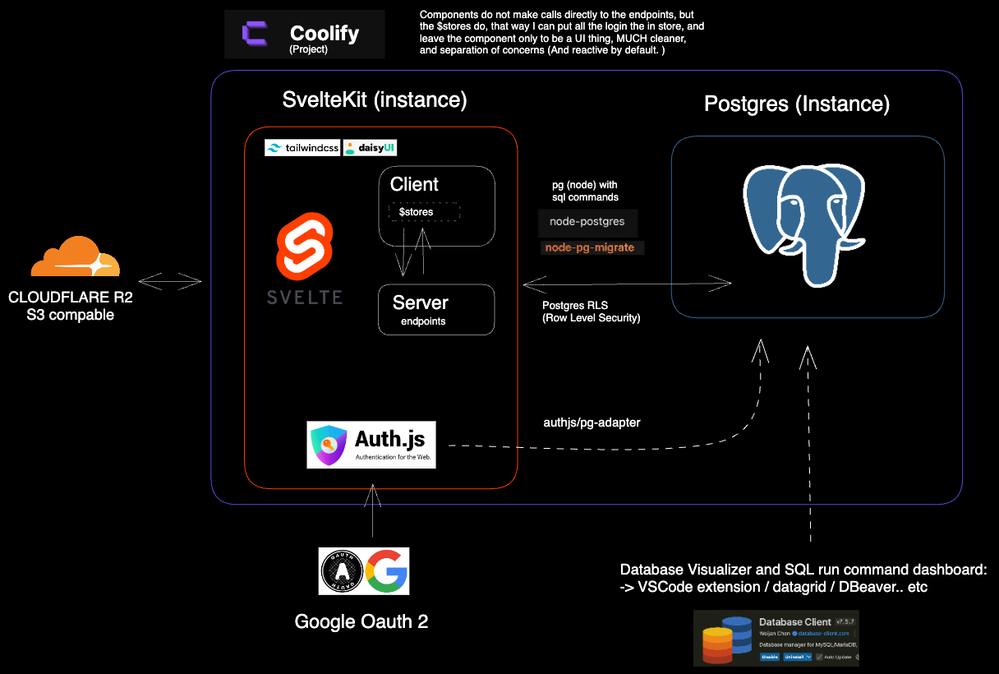

# Top-SvelteKit Template

A unified full-stack template with SvelteKit (Svelte 5), TailwindCSS, DaisyUI, AuthJS, Postgres, and more.\
by [ctwhome](https://ctwhome.com)


[](https://conventionalcommits.org)
[](https://github.com/semantic-release/semantic-release)

## Documentation
- [Installation Guide](docs/INSTALLATION.md) - Complete setup instructions
- [Development Guide](docs/DEVELOPMENT.md) - Development workflow and best practices
- [Database Guide](docs/DATABASE.md) - Database setup and migrations
- [Authentication Guide](docs/AUTH.md) - Authentication system documentation
- [API Documentation](docs/API.md) - Available API endpoints
- [Versioning Guide](docs/VERSIONING.md) - Semantic versioning and release management




## Features

- **Simplicity in code**: Update Svelte stores locally and let syncing happen in the background
- **Future scalability**: Real-time sync, offline-first capabilities
- **Role-Based Access Control**: Server-side authorization with built-in role management
- **Automated Versioning**: Semantic versioning with conventional commits
- **Release Management**: Automated changelog generation and GitHub releases


## Quick Start
1. Copy `.env.example` to `.env` and fill in the required variables

## Runnin with Docker
It will run the database, migrations and frontend services.
```bash
docker compose up
```
### Feeding the database for devepment
```bash
# Start everything (including the seed service):
docker compose --profile seed up
# or just run the seed container on demand:
docker compose --profile seed run seed
```

### Docker utils
```bash
docker compose down -v # Remove all volumes, carefull all data will be lost.
docker compose logs -f
```


## Running locally without docker and external database url (or i.e. local postgres running on port 5432)
```bash
bun install
bun dev
```

Visit [http://localhost:5173](http://localhost:5173) to open the application.

## Development

### Committing Changes
This project supports [Conventional Commits](https://www.conventionalcommits.org/) for automated versioning:

```bash
# Regular commits work normally
git commit -m "update readme"

# Use conventional format for automatic versioning
git commit -m "feat: add new feature"  # Minor version bump
git commit -m "fix: resolve bug"       # Patch version bump
```

No enforcement - commit as you prefer! See [Versioning Guide](docs/VERSIONING.md) for details.

### Release Process
Releases are automated via GitHub Actions when pushing to `main`:
- Automatic version bumping based on commit types
- Changelog generation
- GitHub release creation

View releases at [Releases](../../releases) and changelog at [CHANGELOG.md](CHANGELOG.md).
