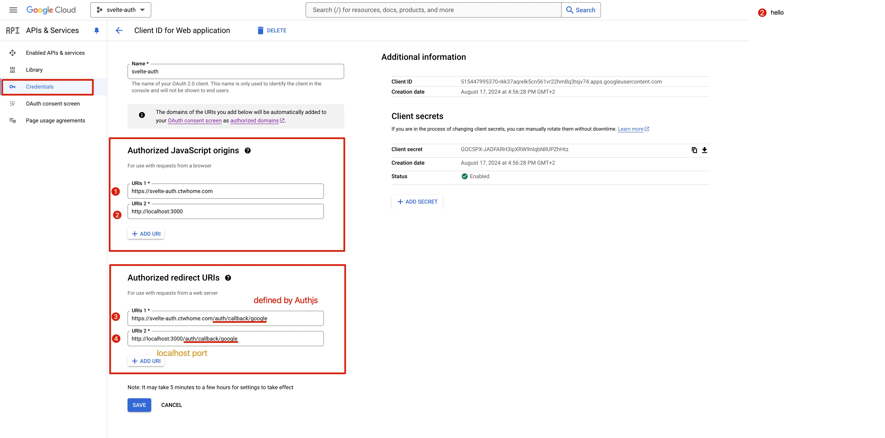

# Ctwhome top-sveltekit
Unified full-stack with SvelteKit (Svelte 5), TailwindCSS, DaisyUI, AuthJS, ElectricSQL Postgres, and more.\
by [ctwhome](https://ctwhome.com)

## Goal of the template
1. **Local-first architecture**: Data lives locally and syncs with the database seamlessly.

2. **Simplicity in code**: Update Svelte stores locally and let syncing happen in the background.

3. **Future scalability**: Add real-time sync, offline-first capabilities, and avoid duplicating effort with local storage or API requests.

4. **Role-Based Access Control**: Server-side authorization with built-in role management.


## Installation and running locally
```bash
bunx degit ctwhome/top-sveltekit <directory-name>
```

```bash
bunx degit ctwhome/top-sveltekit newName --mode=git    # --mode-git if cloning a private repo
```

Libraries to install for auth:
```bash
bun add pg node-pg-migrate dotenv @auth/sveltekit @auth/pg-adapter
```

## Database Migrations
The project uses node-pg-migrate with a simplified three-digit numbering format (001, 002, etc.).

Creating a new migration:
```bash
bun migrate create my_migration_name
```
This will create a new migration file like `migrations/002_my_migration_name.sql`

Running migrations:
```bash
# Development
bun migrate up

# Production
bun migrate:production
```

## Setup Steps:
1. Install the dependencies with `bun install`
2. Generate the google OAUTH credentials for auth.js
3. 
4. Copy the .env.local.example file to .env.local
5. Fill in the .env.local file with your own values
6. Copy the .env.example file to .env
7. Run `npx auth secret` to generate a secret key for the auth.js adapter
8. Run migrations with `bun migrate up`. This will:
   - Create necessary tables including users, roles, and user_roles
   - Set up authentication tables for auth.js
   - Create default roles (admin and user)
   - Create two example users: alice (admin) and bob (user)

## Authentication & Authorization

The template uses Auth.js with PostgreSQL adapter for session management and a server-side gatekeeper for Role-Based Access Control (RBAC). Here's how it works:

### Roles
- By default, any authenticated user is treated as having the 'user' role
- Additional roles (like 'admin') can be explicitly assigned through the `roles` and `user_roles` tables
- Users can have multiple explicit roles
- Users without any explicit roles are automatically treated as regular users

### Protecting Routes
You can protect routes based on roles in two ways:

1. Using the protectRoute middleware directly:
```typescript
// In your +page.server.ts or +server.ts
import { protectRoute } from '$lib/server/gatekeeper';

// For admin-only routes
export const handle = sequence(handleAuth, protectRoute('admin'));

// For authenticated users (no specific role required)
export const handle = sequence(handleAuth, protectRoute('user'));
```

2. Using the provided example for route-based protection:
```typescript
// In hooks.server.ts
export const protectAdminRoutes: Handle = async ({ event, resolve }) => {
  if (event.url.pathname.startsWith('/admin')) {
    return protectRoute('admin')({ event, resolve });
  }
  return resolve(event);
};

export const handle = sequence(handleAuth, protectRoute(), protectAdminRoutes);
```

### Accessing User Roles
User roles are automatically added to the session and can be accessed in your routes and components:

```typescript
// In your +page.svelte
let { session } = await parent();
$: userRoles = session?.user?.roles || ['user']; // Defaults to ['user'] if no explicit roles

// Check if user has admin role
$: isAdmin = userRoles.includes('admin');
```

## Development

Run locally:
```bash
bun dev
```

## Updating fork
1. Add remote from the original repository in your forked repository:
```bash
git remote add upstream git://github.com/ctwhome/top-sveltekit.git
git fetch upstream
```

2. Updating your fork from the original repo to keep up with their changes:
```bash
git pull upstream main
```

Start the development server on [http://localhost:5173](http://localhost:5173)

```bash
bun dev
```

## Production

Build the application for production:

```bash
bun build
