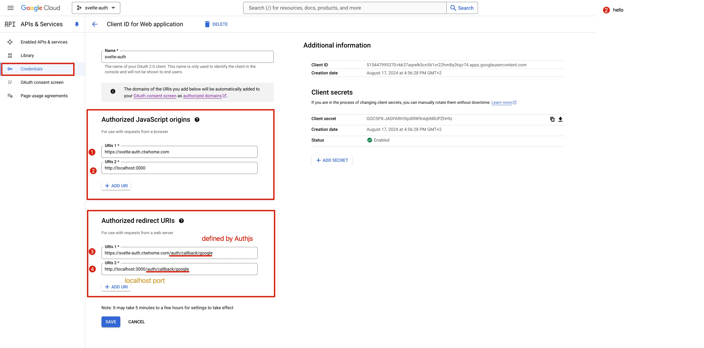

# Installation Guide

## Prerequisites
- Node.js
- Bun (recommended) or pnpm
- PostgreSQL database

## Quick Start

1. Clone the repository:
```bash
bunx degit ctwhome/top-sveltekit <directory-name>
# Or with git mode for private repos:
bunx degit ctwhome/top-sveltekit newName --mode=git
```

2. Install dependencies:
```bash
bun install
```

3. Install authentication libraries:
```bash
bun add pg node-pg-migrate dotenv @auth/sveltekit @auth/pg-adapter
```

## Environment Setup

1. Copy the example environment files:
```bash
cp .env.local.example .env.local
cp .env.example .env
```

2. Generate auth secret:
```bash
npx auth secret
```

3. Configure Google OAuth:
   1. Go to Google Cloud Console
   2. Create new credentials
   3. Configure OAuth consent screen
   4. Add authorized origins and redirect URIs
   

4. Update your `.env` and `.env.local` files with:
   - Database connection details
   - Google OAuth credentials
   - Auth secret
   - Other required environment variables

## Database Setup

1. Ensure PostgreSQL is running and accessible

2. Run the initial migrations:
```bash
bun migrate up
```

This will:
- Create necessary database tables
- Set up authentication tables
- Create default roles (admin and user)
- Create example users: alice (admin) and bob (user)

## Verification

1. Start the development server:
```bash
bun dev
```

2. Visit http://localhost:5173 to verify the installation

3. Try logging in with the example users:
   - Admin: alice@example.com
   - User: bob@example.com
